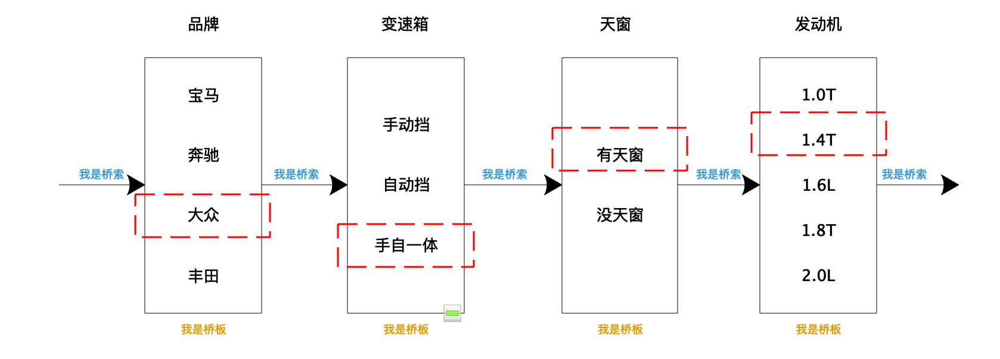

# 定义
1. GoF 的《设计模式》一书中
>将抽象部分与它的实现相分离，是他们可以独立变化。
2. 其他书中
> 一个类存在两个（或多个）独立变化的维度，我们通过组合的方式，让这两个（或多个）维度可以独立进行扩展。

对于第二种的解读，它非常类似“组合优于继承”设计原则，通过组合关系来替代继承关系，避免继承层次的指数级爆炸。
# 理解
假如我们去买车，从品牌、变速箱、天窗、发动机等四个维度去选择汽车，如下图所示，每一维度看着像桥上的木板，每一个维度中只能选择一个选项，然后通过箭头把4块木板连接起来，这样就形成了一个桥（**桥接模式**）。如果使用继承的方式来实现，那么需要实现4*3*2*5=120个类，而采用桥接模式后，需要实现4+3+2+5=14个类，可以极大解放敲代码的双手了。使用的时候`车 = new 品牌(new 变速箱(new 天窗(new 发动机())))`，看着像套娃的结构。

# 题目

根据不同的告警规则，触发不同类型的告警。告警支持多种通知渠道，包括：邮件、短信、微信、自动语音电话。通知的紧急程度有多种类型，包括：SEVERE（严重）、URGENCY（紧急）、NORMAL（普通）、TRIVIAL（无关紧要）。不同的紧急程度对应不同的通知渠道。比如，SERVE（严重）级别的消息会通过“自动语音电话”告知相关人员。

|程度/方式|短信|邮件|微信|语音电话|
|---|----|---|---|---|
|重要|重要-短信|重要-邮件|重要-微信|重要-语音电话|
|紧急|紧急-短信|紧急-邮件|基金-微信|紧急-语音电话|
|普通|普通-短信|普通-邮件|普通-微信|普通-语音电话|
|无关紧要|无关紧要-短信|无关紧要-邮件|无关紧要-微信|无关紧要-语音电话|

# 实现
`Notification` 是抽象，`MsgSender` 是实现，两者可以独立开发，通过组合关系（也就是桥梁）任意组合在一起。所谓任意组合的意思就是，不同紧急程度的消息和发送渠道之间的对应关系，不是在代码中固定写死的，我们可以动态地去指定（比如，通过读取配置来获取对应关系）。