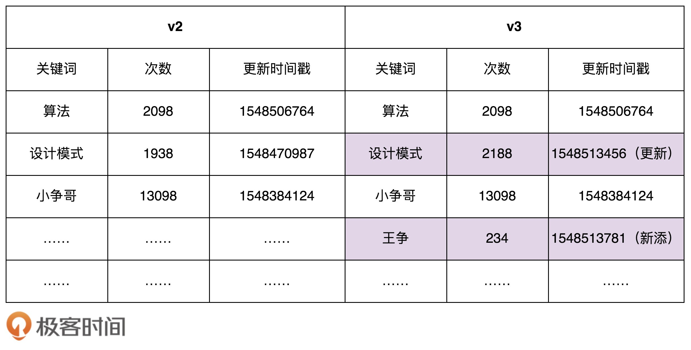

#原型设计模式
## 题目
假设数据库中存储了大约 10 万条“搜索关键词”信息，每条信息包含关键词、关键词被搜索的次数、信息最近被更新的时间等。
系统 A 在启动的时候会加载这份数据到内存中，用于处理某些其他的业务需求。为了方便快速地查找某个关键词对应的信息，我们给关键词建立一个散列表索引。
同时我们还有另外一个系统 B，专门用来分析搜索日志，定期（比如间隔 10 分钟）批量地更新数据库中的数据，并且标记为新的数据版本。

比如，在下面的示例图中，我们对 v2 版本的数据进行更新，得到 v3 版本的数据。
这里我们假设只有更新和新添关键词，没有删除关键词的行为。

我们只需要在系统 A 中，记录当前数据的版本 Va 对应的更新时间 Ta，从数据库中捞出更新时间大于 Ta 的所有搜索关键词，
也就是找出 Va 版本与最新版本数据的“差集”，然后针对差集中的每个关键词进行处理。如果它已经在散列表中存在了，
我们就更新相应的搜索次数、更新时间等信息；如果它在散列表中不存在，我们就将它插入到散列表中。

老师给的代码是够简洁，看的时候自己也都能理解，但是真正换Coding的时候，才知道那是一步三个坎。
我这还是用PHP写，还想写出可以运行出结果的代码。